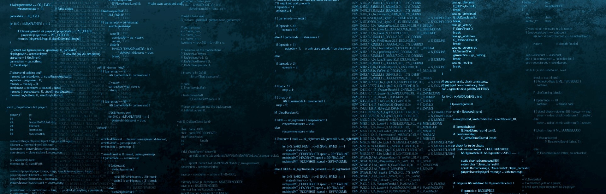

<h1 align="center">Hi, I'm Hassan Khalil</h1>
<h3 align="center">A Passionate Web Developer</h3>

- 🌱 I’m currently learning **Unity**

- 👯 I’m looking to collaborate on **different projects**

- 📫 How to reach me **hassan.khalil.dev@gmail.com**

- ⚡ Fun fact **Did you know, there are around 700 different programming languages!**

<h3 align="left">Connect with me:</h3>

<h3 align="left">Languages and Tools:</h3>

               

&nbsp;

